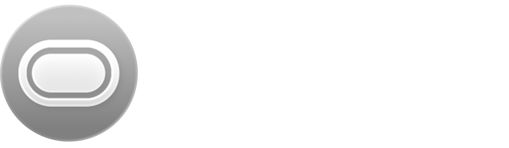

<p align="center">
  
</p>

# WinIsland (Enhanced)

[](https://opensource.org/licenses/MIT)
[](https://www.rust-lang.org/)

> [!IMPORTANT]
> 本项目是基于 [WinIsland](https://github.com/Eatgrapes/WinIsland) 的二次开发版本，感谢原作者 [Eatgrapes](https://github.com/Eatgrapes) 的出色工作。
> 
> This project is a secondary development based on the original [WinIsland](https://github.com/Eatgrapes/WinIsland) repository.

**WinIsland** is a high-performance, visually stunning **Dynamic Island** implementation for Windows. Built with Rust and Skia, it brings fluid animations and system-integrated widgets to your desktop.

## ✨ Features

- 🍎 **Smooth Animations**: Powered by a mass-spring-damper physics engine for a natural "apple-like" feel.
- 🎨 **Modern Aesthetics**:
  - **Enhanced Acrylic & Mica**: Real frosted glass with noise textures and soft outer glows.
  - **Liquid Glass Mode**: Custom SkSL shaders for flowing, organic backgrounds.
- 🎵 **Music Integration**:
  - Full Windows SMTC support (Spotify, NetEase, Web players, etc.).
  - Real-time spectrum visualizer.
  - Dynamic progress bars with color-thief palette extraction.
  - Synchronized lyrics (163 Music & LRCLIB support).
- 🧩 **Plugin System**: Fully extensible via DLL plugins. Add your own widgets or system monitors.
- ⚙️ **Customization**:
  - System-native Color Picker for personalized themes.
  - Configurable FPS display, GPU status, and scaling.
  - Global hotkeys and auto-hide support.

## 🚀 Getting Started

### Prerequisites
- [Rust](https://www.rust-lang.org/tools/install) (latest stable)
- CMake (required by Skia build)

### Build and Run
```cmd
git clone https://github.com/Eatgrapes/WinIsland.git
cd WinIsland
# Build the main application
cargo build --release
# Run
./target/release/WinIsland.exe
```

## 🔌 Plugins
WinIsland supports dynamic DLL plugins. To use a plugin:
1. Create a `plugins` folder next to `WinIsland.exe`.
2. Drop the `.dll` plugin files into the folder.
3. Manage them via **Settings -> Plugins**.

Check the [Development Guide](DEVELOPMENT.md) to build your own plugins.

## 🤝 Contributing
Contributions are welcome! Whether it's bug fixes, UI improvements, or new plugins, feel free to open a PR.

## 📜 License
This project is licensed under the [MIT License](LICENSE).
